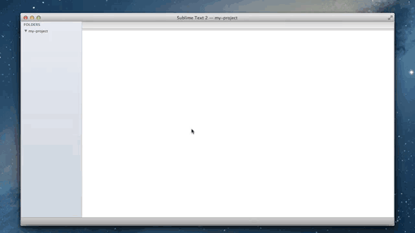

# Bower, for Sublime Text

This is a plugin for Sublime text, it will allow you to install packages via [Twitter's Bower tool](http://twitter.github.com/bower/).

Want to learn about the available packages? Check [Bower components](http://sindresorhus.com/bower-components/) 

## How to use

Run the command "Bower install" to get a list of packages from the canonical bower repository.

Packages will be installed the current working directory. 



## Installation

This plugin has a [pending pull-request](https://github.com/wbond/package_control_channel/pull/1219) to be added to Package control. 

In the meantime, you can manually install it: (In your Terminal)

```bash
  cd ~/Library/Application\ Support/Sublime\ Text\ 2/
  git clone git://github.com/benschwarz/sublime-bower.git Bower
```

## Requirements

* Have bower installed: `npm install bower -g`

## Testing / platforms

* Untested on Linux (Let me know)
* Untested on Windows (Let me know)
* Untested on Sublime Text v3 (Let me know)

#### PSA
This is my first attempt at writing a ST plugin… I don't write python either, so if you think you can help, lemme know. k? word.

## Contributing

* Check the [issue list](https://github.com/benschwarz/sublime-bower/issues) to find something to help with
* Add any implementation queries, ideas or psudeo code
* Fork the project, work in a topic branch
* Send a pull request
* You the boss now, dawg